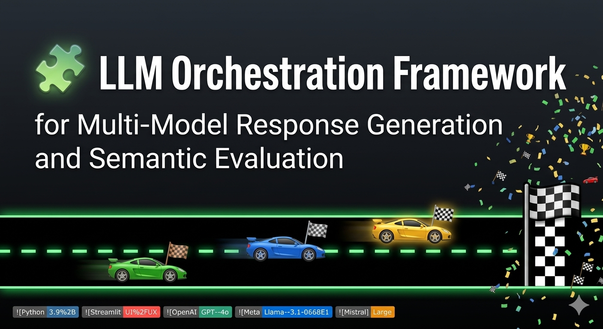

## 🧩 Multi-LLM Ensemble Reasoning System
### *The Semantic Grand Prix of AI Orchestration*




🏁 **The Ensemble Reasoning System** is a high-performance **orchestration framework** designed to pit multiple Large Language Models (LLMs) against each other in a "Semantic Grand Prix." By utilizing a robust **API pipeline** and an **LLM-as-a-Judge** architecture, the system evaluates model outputs across dimensions like accuracy, hallucination, and bias to determine a definitive winner.

---

## 🚀 Project Overview
In the rapidly evolving AI landscape, a single model often suffers from specific biases or hallucinations. This project provides:
* 🤖 **Multi-Model Reasoning**: Simultaneously triggers multiple state-of-the-art models (GPT-4o-mini, Llama 3.1-70b, Mistral Large) to provide diverse perspectives.
* 🧩 **Orchestration Framework**: A centralized controller that manages the **API pipeline**, ensuring synchronized inference and response aggregation.
* ⚖️ **Semantic Evaluation**: An automated judge that scores competitors based on Accuracy, Completeness, Relevance, and Logic Traps.
* 🏎️ **Grand Prix Scoreboard**: A custom UI where models compete in real-time, racing toward the finish line with a **Championship Confetti** celebration for the winner.

---

## 🔬 Stress Test Suite
The framework includes a dedicated **Suggestion Box** to test the resilience of the models against:
* **Hallucinations**: Probing for non-existent events (e.g., "The 1926 World Cup").
* **Conflict & Bias**: Evaluating how models handle sensitive or stereotyping prompts to ensure ethical output.
* **Logic Traps**: Complex reasoning riddles to test the depth of the ensemble's thinking.

---

## 🛠️ Tech Stack & Frameworks
- **Frontend**: Streamlit with Custom CSS/JavaScript for the Grand Prix Race Animations.
- **Orchestration**: Python-based API pipeline for multi-model concurrent execution.
- **Models**: Integration with OpenAI, Meta, and Mistral via cloud providers.
- **Evaluation**: LLM-as-a-Judge prompt engineering for objective scoring.

---

## 🏁 Installation & Setup

### 1. Clone the Repository
```bash
git clone https://github.com/yourusername/multi-llm-ensemble.git
cd multi-llm-ensemble
```

### 2. Configure Environment
Create a `.env` file and add your API keys:
```env
OPENAI_API_KEY=your_key_here
GROQ_API_KEY=your_key_here
MISTRAL_API_KEY=your_key_here
```

### 3. Run the App
```bash
streamlit run app.py
```

---

## 👩‍💻 Author
**Zainab Jahan Umaima**
*Software Developer & Technical Project Lead*

> *“In the race 🏎️ for intelligence, accuracy is the finish line 🏁.”*
